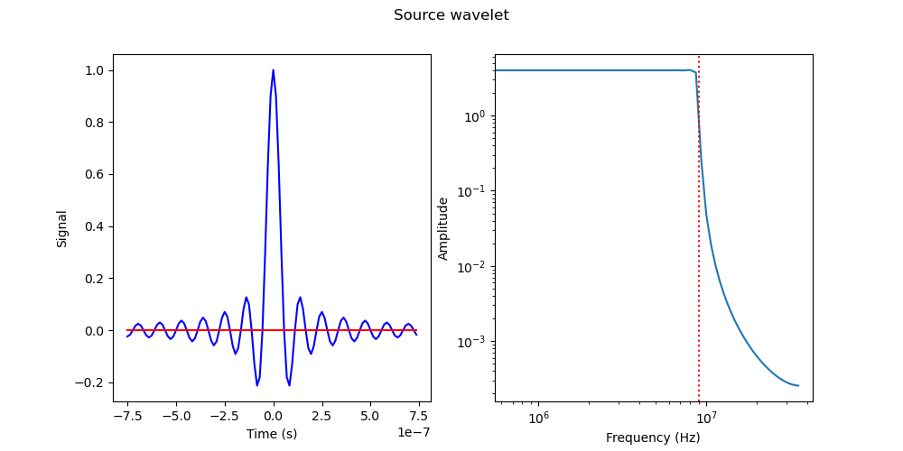

# REASON & RHYME Raypath Simulator

---

## Index
1. [Source](README.md#Source)
2. [Surface](README.md#Surface)
3. [Model](README.md#Model)

---

## Source

### Key Points
* The source class **only** provides a source location and velocity to the simulator. 
* The actual function produced and visualized by the source class is purely a visual aid.
* The source class can generate many different kinds of source functions, but the simulator only uses one kind.
#### Initializing a source
Sources are initalized with a **location**, **sampling rate**, **duration** and **power**. The duration of the signal does not need to span the duration for the data being received. It just needs to be long enough to contain the entire wavelet.
#### Defining a source
Once initalized sources can be defined through calling `gauss_sin`, `ricker` or `chirp`. Each are defined with a center frequency and an optional time offset. `chirp` also requires a bandwidth. The default time offset is 0 s causing only half the wavelet to be realized. ***The simulator only uses a range compressed chirp with a 9 MHz center frequency and 1 MHz bandwidth***.
#### Example
Below is a range compressed chirp - identical to what is used by the simulator. Note the real component in **blue** and imaginary component in **red**.  


---

## Surface

### Initializing a surface
The surface is a very simple class just containing a surface mesh composed of xyz locations as well as surface normals for each facet.  It is defined by a **facet size**, **origin** and **dimension**. 

**Facet size:** 

The facet size is the side length of each facet, defaulting to 10 m. For optimal results this should be $\frac{\lambda}{10}$. 

**Origin:**

The origin is the minimum x and y coordinate of the surface, and the dimensions are how many facets are there in each direction, defined as (x, y). So, with a facet size of 3 m and dimensions of 500x500, the surface is 1.5x1.5 km.

**Overlap:**

Overlap is a value from 0 -> 1 specifing the percentage which facets should overlap on each axis. By default this value is 0, giving facets no overlap. If this were to be 0.5, the 500x500 surface previously described would now cover an area of 750x750 m.

### Defining a surface
Surfaces can be defined with the `gen_flat` function, which generates a surface of a constant elevation (z) and custom normal vectors. By default the normal vectors point upwards, but you can have a flat surface, where all the facets are pointing in a different direction, resulting in discontinuities on the surface.

`gen_sin` is also supported, producing a sinusoidal surface along either the x or y axis.

### Visualizing a surface

`show_surf` will produce a 3D plot of the surface. This does not account for the surface normal directions and instead just uses the Z value. So a "flat" surface with varying normal directions will appear the same, even though the normals are changing.

### Reradiation of energy by individual facets
Each square facet reradiates energy identically to a uniform field passing through an aperature to an observation plane. As the aperture is what our field passes through, it is equivalent to our facet. The observation plane is equivalent to the target location, as this is where we are observing the radiation which passes through the aperature. We can therefore use the following formula to understand how the energy reradiates:


$$E(R,\theta,\phi)=\frac{iE_0r^2}{\lambda}\left(\frac{e^{-ikR}}{R}\right)\cdot\text{sinc}\left(\frac{\pi r}{\lambda}\sin\theta\cos\phi\right)\cdot\text{sinc}\left(\frac{\pi r}{\lambda}\sin\theta\sin\phi\right) \tag{2.1}$$


Where:

 
$$\text{sinc}(t)=\frac{\sin(t)}{t} \tag{2.2}$$

 
To translate this equation from being used for beam patterns of antennas to the reradiation pattern of our facets it is important to note the following:
- $r$ represents side length of the aperture. In the facet model it is equivalent to the side length of the facet.
- $R$ represents the distance from the center of the aperture to the observation plane. This is equivalent to the distance from the facet to the target or from the facet to the source, depending on the direction of the raypath.
- $\theta$ & $\phi$ represent the direction of the source/target relative to the facet center (after being offset by the refracted raypath which is described later).  


*3D reradiation pattern for a single facet*  
  

---

## Simulator
***The following example is for a target directly below the source, with a perfectly flat surface in between.***

*Note: Previously this was called "model" but there was issues with that naming convention.*

### Initializing a simulation

The model class combines the source, surface and target information to produce an accurate representation of a transmitted chirp. It is defined with a predefined surface and source. Then a point target location is set, defined as a tuple of (x, y, z).

### Model settings

Model initialization comes with the option to alter the following settings:
* **power:** Power transmit by the antenna, *default = 11.75 W*
* **reflect:** Enables/disables surface reflection *default = True*
* **eps2:** Dielectric for the subsurface *default = 3.15*
* **sig2:** Conductivity of the subsurface *default = 1e-6*
* **vec:** Vectorized computation of raypaths *default = False* **THIS SHOULD BE ENABLED FOR EFFICIENT  AND PROPER COMPUTATION**
* **polarization:** Polarization of antenna (options = None, "h", "v") *default = None*
* **rough:** Enable/disable change in surface specularity *default = True with rms = 0.4 m* 
* **pt_response:** Change custom point target response function (options = None, "sinusoidal") *default = None*

The following parameters can also be changed once the model is initalized to alter the result, though these are not easily provided in `__init__`:

* *eps1:* Dielectric of space
* *mu1:* Magnetic permeability of space
* *mu2:* Magnetic permeability of subsurface
* *sig1:* Conductivity of space
* *gain:* Antenna gain for subsurface reflections
* *gain_surf:* Antenna gain for surface reflections
* *range_resolution:* Range resolution of radar
* *lam:* Wavelength of chirp
* *rx_window_m:* How many meters is the Rx window open for (defined based off of c in free space)
* *rx_window_offset:* At how many meters does the Rx window open?
* *sampling:* Sampling rate of receiver

**By default the above parameters are set to that of the HF antenna on Europa Clipper.**


### Generating raypaths

Raypath generation produces the constants applied to each raypath. This is done as follows:

### Reflected ray modeling

This section models the path from source to a surface facet and back via **specular reflection**, assuming Snell’s Law for perfect reflection across the facet normal.

**Compute Surface Normals**

Let $\vec{n}_{f}$ be the unit normal vector to each facet. The normals are expressed in both:
- **Cartesian**: $\vec{n}_f$
- **Spherical**: $(r=1, \theta_n, \phi_n)$

The negative normals are also computed as:

$$\vec{n}_{f}^{\text{rev}} = -\vec{n}_f$$

**Ray from Source to Facet**

Let the source be at: 

$$\vec{s}=(x_s, y_s, z_s)$$

And the facet center at:

$$\vec{f} = (X_f, Y_f, Z_f)$$

The vector from source to facet is:

$$\vec{r}_{s \to f} = \vec{f} - \vec{s}$$

Then compute:
- **Spherical direction**: $(\rho_1, \theta_1, \phi_1)$
- **Reverse direction**: $-\vec{r}_{s \to f}$

The **slant range** is:

$$\text{Slant range} = \|\vec{r}_{s \to f}\| = \rho_1$$

**Relative Incident Angles**

The angle of incidence relative to the surface normal is calculated as:

$$\Delta \theta = \theta_{\text{ray}} - \theta_{\text{normal}}$$

$$\theta_1 = \Delta \theta - \pi$$

This represents the deviation from normal incidence in spherical coordinates (note the $-\pi$ to align downward z).

**Fresnel Reflection Coefficients**

For **horizontal** and **vertical** polarizations:

- Horizontal ($h$) polarization:

$$\rho_h = \frac{\nu_2 \cos(\theta_1) - \nu_1 \cos(\theta_2)}{\nu_2 \cos(\theta_1) + \nu_1 \cos(\theta_2)}, \quad \Gamma_h = |\rho_h|^2, \quad T_h = 1 - |\rho_h|^2$$

- Vertical ($v$) polarization:

$$\rho_v = \frac{\nu_2 \cos(\theta_2) - \nu_1 \cos(\theta_1)}{\nu_2 \cos(\theta_2) + \nu_1 \cos(\theta_1)}, \quad \Gamma_v = |\rho_v|^2, \quad T_v = 1 - |\rho_v|^2$$

Where:
- $\nu_i$ is wave impedance (or velocity in acoustic models) of medium \( i \)
- $\theta_1$, $\theta_2$ are the incidence and transmission angles

**Electromagnetic Roughness**

If surface roughness is modeled, apply an exponential attenuation:

$$\psi = k_s \cos(\theta), \quad \text{attenuation factor} = \exp(-4 \psi^2)$$

This attenuates both reflected and transmitted energy.

**Aperture and Target Effects**

- **Target Response**: If enabled, multiply by a sinusoidal pattern:
  
$$\text{Amplitude} \propto \sin(f \phi) \quad \text{or} \quad \sin(f \theta)$$

- **Beam Pattern Correction**: Correct for antenna directivity:
  
$$B(\theta, \phi) = \text{BeamPattern3D}(\theta, \phi, \lambda, f_s, r)$$

**Radar Equation**

The radar equation computes received power $P_r$ from:

$$P_r = \frac{P_t G^2 \sigma \lambda^2}{(4\pi)^3 R^4}$$

**Attenuation in Medium**

Apply exponential decay for two-way path:

$$\text{Loss} = \exp(-2\alpha_1 \rho_1)$$

**Final reflection coefficient**

$$R_{total} = \Gamma_p \cdot B(\theta, \phi) \cdot \text{RadarEq} \cdot \exp(-2\alpha_1 \rho_1) \cdot \exp(-4 \psi_1^2)$$

### Refracted Ray Modeling

This section models the **refracted** wave passing through the surface into a subsurface medium.

**Compute Facet-to-Target Ray**

Given the target point:

$$\vec{t} = (x_t, y_t, z_t)$$

Define:

$$\vec{r}_{f \to t} = \vec{t} - \vec{f}$$

Normalize and convert to spherical coordinates.

**Compute Refracted Vector**

Using `comp_refracted_vectorized`, compute the refracted ray direction $\vec{v}_{\text{refr}}$ from Snell’s Law:

Given:

$$
n_1 \sin(\theta_1) = n_2 \sin(\theta_2)
\Rightarrow \theta_2 = \arcsin\left(\frac{v_2}{v_1} \sin(\theta_1)\right)
$$

- The direction is adjusted in spherical space
- If $\sin(\theta_2) > 1$, total internal reflection occurs and the ray is blocked

**Angular Mismatch (Refracted Path vs Target Vector)**

Compute:

$$
\Delta\theta_2 = \theta_{\text{target}} - \theta_{\text{refr}}
$$

$$
\Delta\phi_2 = \phi_{\text{target}} - \phi_{\text{refr}}
$$

These differences represent the mismatch between the refracted direction and the actual direction to the target.

**Reverse Refracted Path**

To simulate energy **exiting the subsurface**, compute the **reverse refracted ray** using:

```python
comp_refracted_vectorized(..., rev=True)
```

**Final refraction coefficient**

$$
T_{total} = \Gamma_{p,in} \cdot \Gamma_{p,out} \cdot B_{in} \cdot B_{out} \cdot \text{RadarEq} \cdot \text{exp}(-2\alpha_1r_1) \cdot \text{exp}(-2\alpha_2r_2) \cdot \exp(-4 \psi_2^2)
$$
