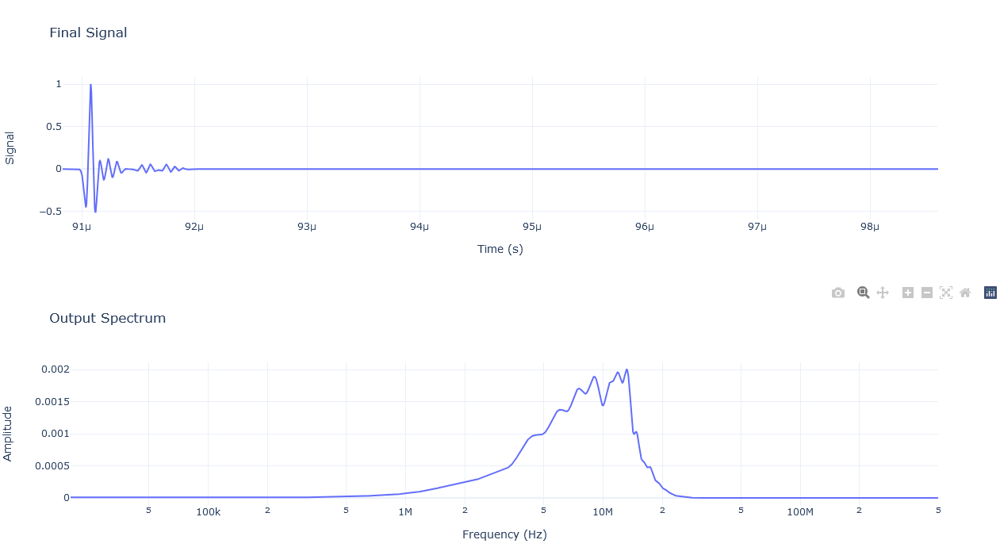

# REASON & RHYME Raypath Simulator

---

## Index
1. [Source](README.md#Source)
2. [Surface](README.md#Surface)
3. [Model](README.md#Model)

---

## Source

#### Initializing a source
Sources are initalized with a **location**, **sampling rate**, **duration** and **power**. The duration of the signal does not need to span the duration for the data being received. It just needs to be long enough to contain the entire wavelet.
#### Defining a source
Once initalized sources can be defined through calling `gauss_sin` or `ricker` which generates either a gaussian sin wavelet or a ricker wavelet correspondingly. Each are defined with a center frequency and an optional time offset. The default time offset is 0 s causing only half the wavelet to be realized.
#### Example
This shows a rickerwavelet with a center frequency of 9 MHz with a time offset of 250 ns.  

---

## Surface

#### Initializing a surface
The surface is a very simple class just containing a surface mesh composed of xyz locations as well as surface normals for each facet.  It is defined by a **facet size**, **origin** and **dimension**. The facet size is the side length of each facet, defaulting to 10 m, but being set at 100 m in the example notebook. The origin is the minimum x and y coordinate of the surface, and the dimensions are how many facets are there in each direction, defined as (x, y). So, with a facet size of 100 m and dimensions of 50 m by 50 m, the surface is 5 km by 5 km.
#### Defining a surface
Surfaces can be defined with the `gen_flat` function, which generates a surface of a constant elevation (z) and custom normal vectors. By default the normal vectors point upwards, but you can have a flat surface, where all the facets are pointing in a different direction, resulting in discontinuities on the surface.
#### Visualizing a surface
`show_surf` will produce a 3D plot of the surface. This does not account for the surface normal directions and instead just uses the Z value. So a "flat" surface with varying normal directions will appear the same, even though the normals are changing.
#### Reradiation of energy by individual facets
Each square facet reradiates energy identically to a uniform field passing through an aperature to an observation plane. As the aperture is what our field passes through, it is equivalent to our facet. The observation plane is equivalent to the target location, as this is where we are observing the radiation which passes through the aperature. We can therefore use the following formula to understand how the energy reradiates:

$$E(R,\theta,\phi)=\frac{iE_0r^2}{\lambda}\left(\frac{e^{-ikR}}{R}\right)\cdot\text{sinc}\left(\frac{\pi r}{\lambda}\sin\theta\cos\phi\right)\cdot\text{sinc}\left(\frac{\pi r}{\lambda}\sin\theta\sin\phi\right) \tag{2.1}$$

Where:

 
$$\text{sinc}(t)=\frac{\sin(t)}{t} \tag{2.2}$$

 
To translate this equation from being used for beam patterns of antennas to the reradiation pattern of our facets it is important to note the following:
- $r$ represents side length of the aperture. In the facet model it is equivalent to the side length of the facet.
- $R$ represents the distance from the center of the aperture to the observation plane. This is equivalent to the distance from the facet to the target or from the facet to the source, depending on the direction of the raypath.
- $\theta$ & $\phi$ represent the direction of the source/target relative to the facet center (after being offset by the refracted raypath which is described later).  

*3D reradiation pattern for a single facet*  
  

---

## Model
***The following example is for a target directly below the source, with a perfectly flat surface in between.***
#### Initializing a model
The model is the class which actually simulates the propagation of the wavefront. It is simply defined with a predefined surface and source. Then a point target location is set, right now this is just a simple (x, y, z) tuple which defines the location and nothing else.
#### Generating raypaths
Generating raypaths produces a value for each facet which acts as the percentage of energy returned back to the source after reflecting off the target and passing through the facet twice. To do this the following steps occur:
1. Raypath instances are created. Raypaths start at the source and go to the facet. Then they are forced to go through the facet and towards the point target. Is is important to note that this is not the direction of the naturally refracted raypath.
2. The naturally refracted raypath is calculated in spherical coordinates, relative to the facet normal as a datum. This gives a $\phi_1$ angle relative to the normal of the facet, while staying in a 3D coordinate system. As this is entirely relative to the facet normal we need to add $\pi$. This entire calculation is done via the following formula which is a modified form of Snell's Law:  
$$\theta_{refr} = \theta_{i} \tag{3.1} $$
$$\phi_{refr} = \arcsin\left(\frac{\sqrt{\epsilon_2}}{\sqrt{\epsilon_1}}\sin\left(\phi_{i}-\phi_{facet}\right)\right) + \pi \tag{3.2} $$
3. The $\Delta\theta$ and $\Delta\phi$ between the refracted ray and the forced ray (facet to target) are computed. This difference is used to find the fraction of the radiation making it to the target from the source.  
***The below figure shows difference in angle between the forced ray and the refracted ray.*** Note how $\Delta\theta$ is constantly $\pi$. This is because the refracted ray is always pointing away from the source, but the forced raypaths point back towards the source as the target is directly below the source. So they point in opposite directions for the $\theta$ axis but not necessarily the $\phi$ axis. 
  
4. The direction of the refracting ray exiting the subsurface is computed. This is done similar to in step 2 but requires reversing the direction of the rays. Computationally this is done by multiplying by $-1$ while in cartesian coordinates, but is equivalent to the following:  

$$\theta_{refr} = \pi - \theta_{i} \tag{3.3} $$
$$\phi_{refr} = \arcsin\left(\frac{\sqrt{\epsilon_1}}{\sqrt{\epsilon_2}}\sin\left(\phi_{i}-\phi_{facet}\right)\right) + \pi \tag{3.4} $$

5. Step 3 is repeated for the refracted ray coming out of the subsurface, and the fraction of radiation which makes it from the target to the source (defined by $2.1$) is multiplied by that of the source to the target.
6. The radar equation is multiplied by the reradiation fraction resulting in a value of the amount of energy which goes through each facet and returns back to the source.  

$$P_e = \frac{P_sG^2\sigma\lambda^2}{(4\pi)^3R^4} \tag{3.5}$$

- $P_s$ - Power emit by antenna
- $G$   - Antenna gain
- $\sigma$ - Radar cross section (set as 1 for time being)
- $\lambda$ - Wavelength
- $R$ - One way raypath distance  

***Reradiation amount for the entire footprint***  
  
#### Timeseries generation
Timeseries generation is performed by the `gen_timeseries` function which generates the returned signal from the source &rarr; facet &rarr; target &rarr; facet &rarr; source raypaths. **This is the final simulated signal**. It is created by the following steps:
1. Using the travel time for each raypath an offset is created in terms of indicies based off of the `dt` value defined by the source.
2. The source wavelet is multiplied by the trasmitted energy value defined as the returned energy from each facet created when generating raypaths.
3. The source wavelet is 0-padded so the predefined source timeseries starts at the index defined previously.
4. All modified and padded source wavelets are stacked to get the final timeseries.   
***This is an example timeseries and spectrum for a flat surface***
